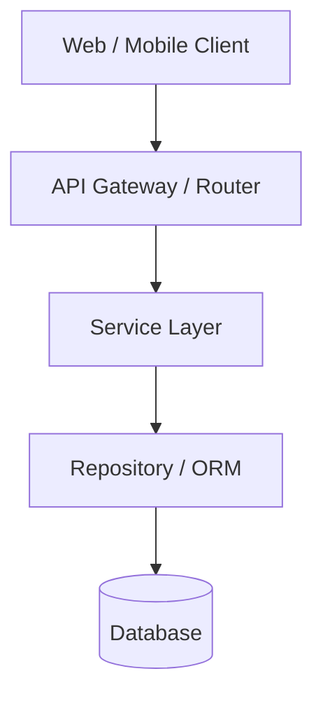

# Architecture Documentation

## Overview
High-level overview of the system architecture, boundaries, and components.

## System Topology

## Core Modules & Boundaries
- **Frontend**: Responsive UI, typed client components, centralized state management, and API clients.
- **Backend / API**: Structured controllers/views, authentication, authorization, and centralized error handling.
- **Business Logic**: Dedicated service layer isolating domain logic from framework endpoints.
- **Data Access**: Migrations, models, constraints, and optimized queries.
