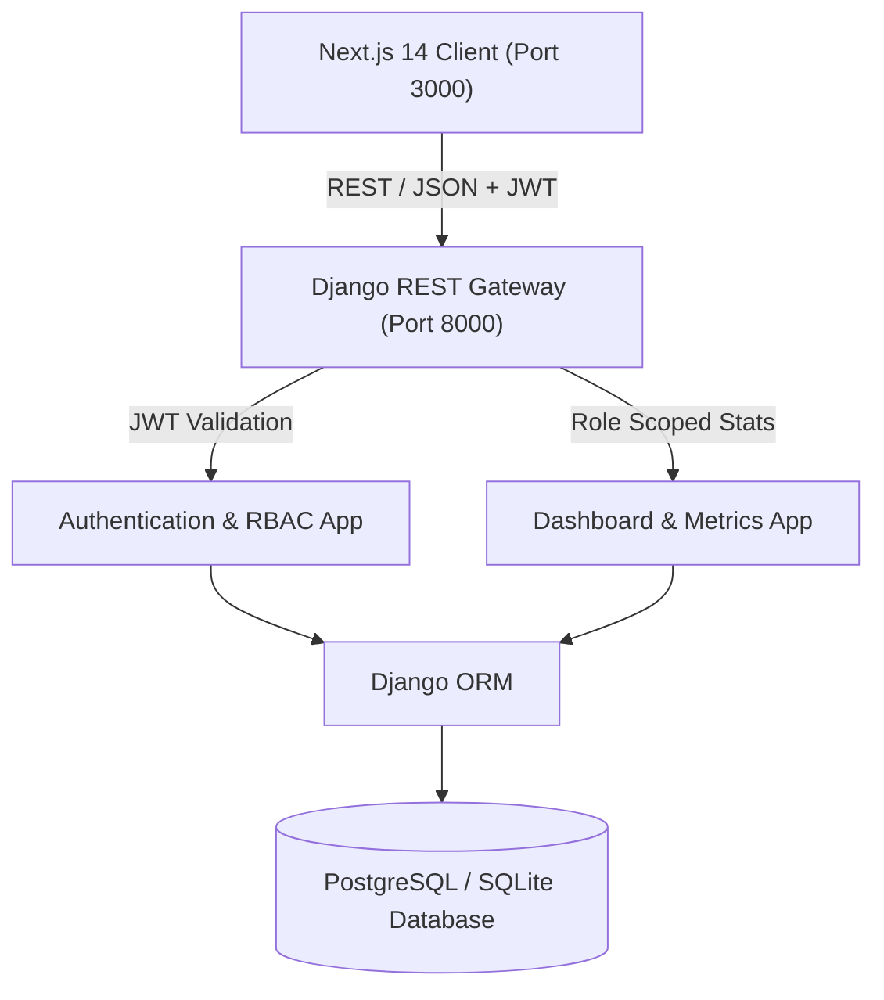

# Architecture Documentation

## System Overview
The application is structured as a decoupled, production-ready SaaS platform adhering to the JARVIS operating protocol:
- **Frontend**: Next.js 14 (TypeScript) with Tailwind CSS, context-based session management, and responsive dashboards.
- **Backend**: Django REST Framework (Python 3) implementing a service-oriented architecture with JWT authentication, RBAC, and standardized response schemas.
- **Database**: PostgreSQL (with SQLite compatibility for rapid zero-dependency local runs).
- **Orchestration**: Docker Compose with health checks and volume persistence.

## System Topology


## Security & RBAC Model
1. **Authentication**: `djangorestframework-simplejwt` issuing signed HS256 tokens with custom claims (`role`, `email`, `name`).
2. **Access Control**:
   - `ADMIN`: Complete system access, user registry inspection, and dynamic role reassignment (`/api/dashboard/admin/users/`).
   - `MEMBER`: Tenant-isolated access to member metrics and services.
3. **Response Envelope**: Every API endpoint responds in the format dictated by `05-api.md`:
   ```json
   {
     "success": true,
     "data": { ... },
     "message": "Operation successful"
   }
   ```
